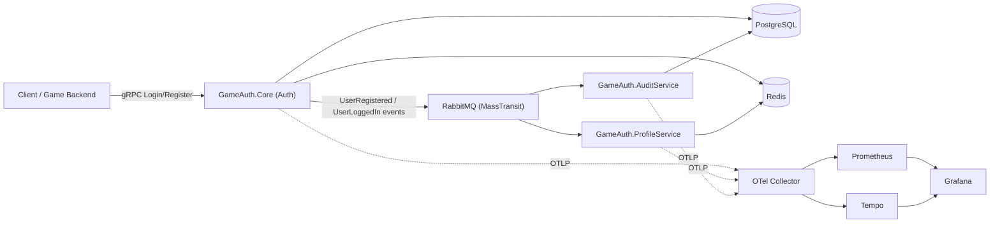

# GameAuthServer - Multi-Million User Game Authentication Server

A production-grade, microservices-based authentication platform built on **.NET 10**, designed for
high-throughput game backends with full observability, event-driven integration, and container-based deployment.

## Table of Contents
- [Architecture Overview](#architecture-overview)
- [Solution Structure](#solution-structure)
- [Implemented Components](#implemented-components)
- [Technology Stack](#technology-stack)
- [Database Schema](#database-schema)
- [Communication Patterns](#communication-patterns)
- [Observability](#observability)
- [Configuration](#configuration)
- [Getting Started](#getting-started)
- [Testing](#testing)
- [Security Features](#security-features)
- [Known Gaps and Roadmap](#known-gaps-and-roadmap)

## Architecture Overview

Three independently deployable services (Auth, Profile, Audit) share a common Infrastructure layer, gRPC
contracts, and cross-cutting service defaults. Services communicate synchronously via **gRPC** and
asynchronously via a **MassTransit/RabbitMQ** event bus. State is split between **PostgreSQL** (durable)
and **Redis** (sessions, token revocation, profile cache). Every service emits **OpenTelemetry** traces
and metrics and structured **Serilog** logs.



### Key Features
- Credential auth with **JWT** access/refresh tokens + **TOTP MFA**
- Hybrid data layer: **PostgreSQL** (persistent) + **Redis** (sessions, revocation, caching)
- **gRPC** inter-service communication with generated contracts
- **MassTransit** event bus over **RabbitMQ**
- **OpenTelemetry** distributed tracing and metrics, exported to Prometheus + Tempo
- **Serilog** structured logging with trace/span correlation
- Shared **ServiceDefaults** for consistent middleware, telemetry, and health checks
- Central NuGet package management via `Directory.Packages.props`

## Solution Structure

```
GameAuthServer/
├── src/
│   ├── GameAuth.Shared/          Common DTOs, domain events, exceptions, interfaces
│   ├── GameAuth.Protos/          gRPC/protobuf service definitions
│   ├── GameAuth.Infrastructure/  EF Core, repositories, Redis caching, MassTransit, migrations
│   ├── GameAuth.ServiceDefaults/ OTel, Serilog, correlation-id/exception middleware, rate limiting
│   ├── GameAuth.Core/            Authentication service (JWT, MFA, gRPC)
│   ├── GameAuth.ProfileService/  User profile management (gRPC + event consumer)
│   └── GameAuth.AuditService/    Audit logging (gRPC + event consumers)
├── tests/
│   ├── GameAuth.Core.Tests/           Password hashing and MFA unit tests
│   ├── GameAuth.Infrastructure.Tests/ Repository tests (SQLite in-memory)
│   └── GameAuth.ProfileService.Tests/ Profile model tests
├── deploy/
│   ├── docker-compose.yml             Full local stack (services + infra + observability)
│   ├── GameAuth.*.Dockerfile          Per-service multi-stage builds
│   └── observability/                 OTel Collector, Tempo, Prometheus, Grafana provisioning
├── Directory.Packages.props           Central package version management
└── GameAuthServer.slnx                Solution file
```

## Implemented Components

### GameAuth.Shared
- **Interfaces**: `IRepository<T>`, `IUnitOfWork`, `ICacheService`, `IEventBus`, `IServiceClient`
- **Events**: `BaseEvent` + 7 domain events (UserRegistered, UserLoggedIn, MfaChallengeInitiated,
  TokenGenerated, UserProfileUpdated, SecurityEventTriggered, ServiceHealth)
- **Exceptions**: AuthException, ValidationException, UnauthorizedException, ForbiddenException, RateLimitException
- **Models**: `Result<T>`, `PagedResult<T>`

### GameAuth.Protos
- `auth/auth_service.proto` - Login, Register, ValidateToken, RefreshToken, Logout, InitiateMfaChallenge
- `profile/profile_service.proto` - GetProfile, UpdateProfile, GetSettings, UpdateSettings
- `audit/audit_service.proto` - LogEvent, QueryLogs, GetSecurityEvents
- `common/common.proto` - Shared types (UserIdentity, ErrorDetails, TimestampMessage, Empty)
- Generated with `GrpcServices=Both` (server base classes + typed clients)

### GameAuth.Infrastructure
- **EF Core** `GameAuthDbContext` with snake_case mappings for users, credentials, mfa_settings, sessions, audit_logs
- **Repositories**: `BaseRepository<T>` and `UserRepository` (username/email lookups, credential/MFA includes)
- **Caching**: `RedisCacheService`, `SessionCacheService` (JSON `SessionState`), `TokenRevocationService`
- **Event bus**: `EventPublisher` (implements `IEventBus`) + `MassTransitConfiguration` (RabbitMQ)
- **DI**: `AddInfrastructure(configuration, configureConsumers)` single entry point
- **Migration**: `InitialCreate` (Npgsql/PostgreSQL)

### GameAuth.ServiceDefaults
- `AddServiceDefaults` / `UseServiceDefaults` - OTel, health checks, correlation-id and exception middleware
- `UseSerilogDefaults` - structured logging enriched with trace/span context
- OpenTelemetry tracing/metrics with Prometheus scraping and optional OTLP export
- `AddRateLimitingDefaults` / `UseRateLimitingDefaults` - Redis-backed distributed IP rate limiting (AspNetCoreRateLimit) shared across all services and replicas

### GameAuth.Core (Authentication)
- `Argon2PasswordHasher` - Argon2id hashing with per-hash salt and constant-time verification
- `JwtTokenService` - access token generation (HS256) + refresh token generation + validation
- `TotpMfaService` - TOTP secret generation and code validation (Otp.NET)
- `AuthGrpcService` - Register, Login (with MFA), ValidateToken, Logout, RefreshToken, InitiateMfaChallenge
- Publishes `UserRegisteredEvent` / `UserLoggedInEvent`; JWT bearer auth configured

### GameAuth.ProfileService
- `RedisProfileStore` - JSON-backed profile and settings storage
- `ProfileGrpcService` - GetProfile, UpdateProfile, GetSettings, UpdateSettings
- `UserRegisteredConsumer` - auto-provisions a default profile on registration

### GameAuth.AuditService
- `AuditLogStore` - EF-backed persistence and paged querying
- `AuditGrpcService` - LogEvent, QueryLogs, GetSecurityEvents
- Consumers for `UserLoggedInEvent`, `UserRegisteredEvent`, `SecurityEventTriggeredEvent`

## Technology Stack

| Area | Technology |
|------|------------|
| Runtime | .NET 10, ASP.NET Core |
| Persistence | Entity Framework Core 10, Npgsql / PostgreSQL |
| Caching | Redis (StackExchange.Redis) |
| Messaging | RabbitMQ + MassTransit |
| RPC | gRPC (Grpc.AspNetCore) |
| Rate limiting | AspNetCoreRateLimit + Redis distributed store |
| Security | JWT (HS256), Argon2id (Konscious), TOTP (Otp.NET) |
| Observability | OpenTelemetry, Prometheus, Tempo, Grafana, Serilog |

Exact versions are pinned centrally in `Directory.Packages.props`.

## Database Schema

Managed by EF Core (`GameAuthDbContext`) and the `InitialCreate` migration. Tables use snake_case naming.

### users
```sql
CREATE TABLE users (
    id BIGSERIAL PRIMARY KEY,
    username VARCHAR(255) UNIQUE NOT NULL,
    email VARCHAR(255) UNIQUE NOT NULL,
    created_at TIMESTAMP DEFAULT CURRENT_TIMESTAMP,
    updated_at TIMESTAMP DEFAULT CURRENT_TIMESTAMP
);
```

### credentials
```sql
CREATE TABLE credentials (
    id BIGSERIAL PRIMARY KEY,
    user_id BIGINT REFERENCES users(id) ON DELETE CASCADE,
    password_hash VARCHAR(255) NOT NULL,
    created_at TIMESTAMP DEFAULT CURRENT_TIMESTAMP,
    updated_at TIMESTAMP DEFAULT CURRENT_TIMESTAMP
);
```

### mfa_settings
```sql
CREATE TABLE mfa_settings (
    id BIGSERIAL PRIMARY KEY,
    user_id BIGINT UNIQUE REFERENCES users(id) ON DELETE CASCADE,
    mfa_type VARCHAR(50),
    mfa_secret VARCHAR(255),
    backup_codes TEXT[],
    verified BOOLEAN DEFAULT FALSE,
    created_at TIMESTAMP DEFAULT CURRENT_TIMESTAMP
);
```

### sessions
```sql
CREATE TABLE sessions (
    id BIGSERIAL PRIMARY KEY,
    user_id BIGINT REFERENCES users(id) ON DELETE CASCADE,
    session_id VARCHAR(255) NOT NULL,
    refresh_token VARCHAR(512) NOT NULL,
    expires_at TIMESTAMP NOT NULL,
    ip_address VARCHAR(64),
    user_agent TEXT,
    created_at TIMESTAMP DEFAULT CURRENT_TIMESTAMP
);
```

### audit_logs
```sql
CREATE TABLE audit_logs (
    id BIGSERIAL PRIMARY KEY,
    user_id BIGINT REFERENCES users(id),
    event_type VARCHAR(100) NOT NULL,
    event_source VARCHAR(50) NOT NULL,
    ip_address VARCHAR(64),
    user_agent TEXT,
    status VARCHAR(50),
    timestamp TIMESTAMP DEFAULT CURRENT_TIMESTAMP
);

CREATE INDEX idx_audit_logs_user_id_timestamp ON audit_logs(user_id, timestamp);
CREATE INDEX idx_audit_logs_event_type_timestamp ON audit_logs(event_type, timestamp);
```

> Note: active sessions and revoked tokens are also cached in Redis; the `sessions` table provides
> durable session records.

## Communication Patterns

### Synchronous (gRPC)
- External client -> `AuthService.Login` / `Register` / `RefreshToken`
- Service-to-service -> `AuthService.ValidateToken(token)`

### Asynchronous (event bus)
```
Register (gRPC)
   |
AuthService publishes UserRegisteredEvent
   |-> AuditService consumer  -> writes audit_logs row
   |-> ProfileService consumer -> creates default profile

Login (gRPC)
   |
AuthService publishes UserLoggedInEvent
   |-> AuditService consumer -> writes audit_logs row
```

## Observability

```
Services (Core, Profile, Audit)
  | (OpenTelemetry SDK: traces + metrics)
  |-> /metrics endpoint  -> scraped by Prometheus (9090)
  |-> OTLP :4317         -> OTel Collector -> Tempo (traces, 3200)
                                            -> Grafana (3000) dashboards
Serilog structured logs -> console (trace/span correlated)
```

Provisioned in `deploy/observability/`:
- `otel-collector-config.yaml` - OTLP receivers, batch processor, Tempo exporter
- `tempo.yaml` - trace storage
- `prometheus.yml` - scrape config for the three services
- `alert-rules.yml` - ServiceDown, HighHttpErrorRate, HighRequestLatency
- `grafana/provisioning/` - Prometheus + Tempo datasources and the "GameAuth Services Overview" dashboard

## Configuration

Each service reads configuration from `appsettings.json`, overridable by environment variables
(double-underscore syntax, e.g. `ConnectionStrings__PostgreSQL`).

```json
{
  "ConnectionStrings": {
    "PostgreSQL": "Host=localhost;Port=5432;Database=gameauth;Username=gameauth;Password=gameauth",
    "Redis": "localhost:6379"
  },
  "Jwt": {
    "Issuer": "GameAuth",
    "Audience": "GameAuth.Clients",
    "SigningKey": "CHANGE_ME_TO_A_SECURE_32_PLUS_CHARACTER_SIGNING_KEY",
    "AccessTokenMinutes": 15,
    "RefreshTokenDays": 7
  },
  "RabbitMQ": { "Host": "localhost", "Port": 5672, "Username": "guest", "Password": "guest" },
  "OpenTelemetry": { "OtlpEndpoint": "http://localhost:4317" }
}
```

> Set a strong `Jwt:SigningKey` (>= 32 chars) for the Core service before any real deployment.

## Getting Started

### Prerequisites
- .NET 10 SDK
- Docker Desktop (for the local stack)
- `dotnet-ef` global tool (for migrations): `dotnet tool install --global dotnet-ef`

### Run the full stack with Docker
```powershell
cd deploy
docker compose up --build
```

| Endpoint | URL |
|----------|-----|
| Core (Auth) gRPC | http://localhost:8080 |
| Profile gRPC | http://localhost:8081 |
| Audit gRPC | http://localhost:8082 |
| Grafana | http://localhost:3000 (admin/admin) |
| Prometheus | http://localhost:9090 |
| RabbitMQ Management | http://localhost:15672 (guest/guest) |

### Run services locally
```powershell
# Start only the backing infrastructure
cd deploy
docker compose up -d postgres redis rabbitmq otel-collector tempo prometheus grafana

# Apply database migrations
cd ..
dotnet ef database update --project src/GameAuth.Infrastructure --startup-project src/GameAuth.Core

# Run each service (separate terminals)
dotnet run --project src/GameAuth.Core
dotnet run --project src/GameAuth.ProfileService
dotnet run --project src/GameAuth.AuditService
```

## Testing

```powershell
dotnet test
```

| Test project | Coverage |
|--------------|----------|
| GameAuth.Core.Tests | Argon2 password hashing, TOTP MFA validation |
| GameAuth.Infrastructure.Tests | UserRepository against SQLite in-memory |
| GameAuth.ProfileService.Tests | UserProfile serialization / immutability |

All current tests are unit tests (12 total). End-to-end gRPC integration tests are not yet implemented.

## Security Features

Implemented:
- Argon2id password hashing (per-hash salt, constant-time verification)
- JWT access tokens (HS256) + opaque refresh tokens
- TOTP-based MFA (Otp.NET)
- Distributed token revocation and session storage via Redis
- Redis-backed distributed IP rate limiting (enforced consistently across replicas)
- Correlation-id propagation and centralized exception handling

Rate limiting is wired centrally in `ServiceDefaults`, so all services inherit it. Defaults allow
20 requests/second and 300 requests/minute per client IP, overridable via an `IpRateLimiting`
(and optional `IpRateLimitPolicies`) section in a service's `appsettings.json`.

## Known Gaps and Roadmap

The following items from the original design are not yet implemented:
- **Integration tests** - only unit tests exist today
- **RS256 JWT signing** - current implementation uses symmetric HS256
- **MFA backup codes**
- **Jaeger UI** - traces are stored in Tempo and viewed via Grafana instead
- **Kubernetes manifests** - deployment is Docker Compose only (K8s is a future phase)
- **Resilience policies** - Polly packages are available but circuit breakers/retries are not configured

Contributions targeting these gaps are welcome.